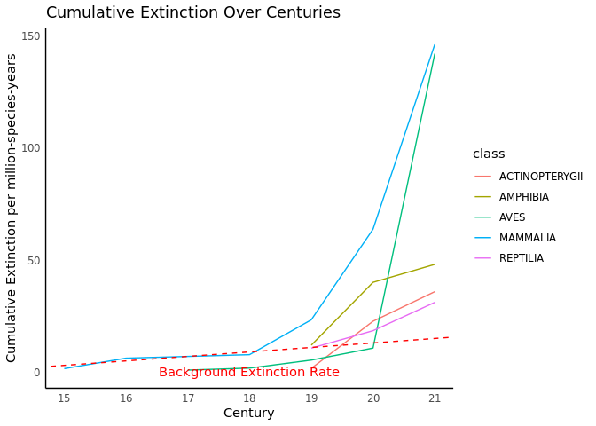

Extinctions Unit
================
Jiawen Tang, Mark Sun

## The Sixth Great Extinctions

*Is “the 6th mass extinction” coming, or is it just an allusion ?*

Understanding the current pace of extinction and how it compares with
the background extinction rate is important, as it will inform us the
future of conservation effort.

## Background

In this report, we aim to reproduce the extinction graph from the above
paper of Ceballos and colleagues. We want to show the recent increase in
extinction rates relative to the background rate:


Before everything starts, we set up the functions that we need to use to
run the code

## Data Download

We download the data that we need from ICUN redlist. Since the original
website is slow as multiple request start at the same time, we extract
data from the pre-download zip from our github.

To keep things simple, we create a local version of rds so we do not
need to download it again and again. This rds will be our data to look
at.

``` r
 if(!file.exists("all_species.rds")) {
   all_species <- map(all_pages, GET)
   map(all_species,stop_for_status)
   write_rds(all_species, "all_species.rds")
 }
```

So setups are finished and we can load the data! From here we begin our
data analysis to to answer our question: if the sixth extinction is
happening, and how does it compare to the backgroud extinction rate?

``` r
all_species<- read_rds("all_species.rds")
all_resp <- map(all_species, content, encoding = "UTF-8")
```

So now we find out there are so many information in the dataset, we will
extract information that are most helpful. We want to know the
scientific name of the species, their category, and their class. After
getting these information, we merge them into a list that we call “all
species”. Since we want to focus on the extinction species, we will
filter the category by “EX”, whichstands for extinction. In this case,
we have the whole list of species that are extinct.

``` r
sci_name <- map(all_resp, \(page) map_chr(page$result,"scientific_name")) |>
  list_c()
category <-
  map(all_resp,\(page) map_chr(page$result,"category")) |>
  list_c()
class <-
  map(all_resp,\(page) map_chr(page$result,"class_name")) |>
  list_c()
all_species <- tibble(sci_name, category,class)

extinct_species <- all_species |> filter(category == "EX")
extinct_species
```

    # A tibble: 936 × 3
       sci_name                   category class         
       <chr>                      <chr>    <chr>         
     1 Mirogrex hulensis          EX       ACTINOPTERYGII
     2 Acanthametropus pecatonica EX       INSECTA       
     3 Achatinella abbreviata     EX       GASTROPODA    
     4 Achatinella buddii         EX       GASTROPODA    
     5 Achatinella caesia         EX       GASTROPODA    
     6 Achatinella casta          EX       GASTROPODA    
     7 Achatinella decora         EX       GASTROPODA    
     8 Achatinella dimorpha       EX       GASTROPODA    
     9 Achatinella elegans        EX       GASTROPODA    
    10 Achatinella juddii         EX       GASTROPODA    
    # ℹ 926 more rows

``` r
ex_sci_name <-extinct_species$sci_name
```

Since it’s still a lot of data, we want to storage it to local to save
our process as well. rds will be our working format and we do the same
things as before.

``` r
if(!file.exists("ex_narrative.rds")) {
  ex_narrative <- map(all_pages, GET)
  write_rds(ex_narrative, "ex_narrative.rds")
}
```

Read the rds file and we will start finding the extinction rate.

``` r
ex_narrative <-read_rds("ex_narrative.rds")
```

## Data Conversion

So we want to use map function to extract the information from the rds
file to the list of words that can have information about the extinction
data. These information will be in plain text that is not in a
consistent format that we can find the number directly.

``` r
narrative_contents <- map(ex_narrative,content)
narrative_population <- map(narrative_contents,
                            \(content) map_chr(content$result[1],"population",.default = ""))
narrative_rationale <- map(narrative_contents,\(content) content$result[[1]]$rationale)
```

So how are we going to get dates from plain text? Regular expressions.
We start simple and just grab any 4-digit numbers, we will just trust it
as year (which there are two errors and we ignore it with the huge data
set we have). Now we will find out the extinction time and species
category. We will group by class, arrange by century, and limit it for
the five big vertebrates. We will have numbers of extinction in each
species and order by centuries; we will calculate the extinctions per
million-species-years, to see what will present use the extinction rate.

``` r
last_seen <-narrative_population |>
  map_chr(str_extract,"\\d{4}") |>
  as.integer()
extintion_dates <- tibble(sci_name = ex_sci_name,last_seen) |> distinct()
combined <- all_species |> left_join(extintion_dates)
```

    Joining with `by = join_by(sci_name)`

``` r
total_sp <- combined |> 
  filter(class %in% c('MAMMALIA', 'AVES','AMPHIBIA','REPTILIA', 'ACTINOPTERYGII')) |>
  count(class, name = "total")
final_tbl <- combined |> 
  filter(category == "EX") |>
  filter(class %in% c('MAMMALIA', 'AVES','AMPHIBIA','REPTILIA', 'ACTINOPTERYGII')) |>
  mutate(last_seen = replace_na(last_seen, 2023),
         century = str_extract(last_seen, "\\d{2}")) |>
  count(century, class) |>
  left_join(total_sp) |>
  mutate(extinct_perc = (n/total) *10000)|> # extinctions per million-species-years
  mutate(century = as.numeric(century),
         century = ifelse(century < 21, century + 1, 21))
```

    Joining with `by = join_by(class)`

``` r
final_tbl
```

    # A tibble: 20 × 5
       century class              n total extinct_perc
         <dbl> <chr>          <int> <int>        <dbl>
     1      15 MAMMALIA           1  6427        1.56 
     2      16 MAMMALIA           3  6427        4.67 
     3      17 AVES               1 11188        0.894
     4      18 AVES               1 11188        0.894
     5      18 MAMMALIA           1  6427        1.56 
     6      19 ACTINOPTERYGII     4 24223        1.65 
     7      19 AMPHIBIA           9  7487       12.0  
     8      19 AVES               4 11188        3.58 
     9      19 MAMMALIA          10  6427       15.6  
    10      19 REPTILIA          11 10283       10.7  
    11      20 ACTINOPTERYGII    51 24223       21.1  
    12      20 AMPHIBIA          21  7487       28.0  
    13      20 AVES               6 11188        5.36 
    14      20 MAMMALIA          26  6427       40.5  
    15      20 REPTILIA           8 10283        7.78 
    16      21 ACTINOPTERYGII    32 24223       13.2  
    17      21 AMPHIBIA           6  7487        8.01 
    18      21 AVES             147 11188      131.   
    19      21 MAMMALIA          53  6427       82.5  
    20      21 REPTILIA          13 10283       12.6  

## Data Visualization

Now we want to make cumulative extinction rates, so we do mutate a new
rate of extinction.

``` r
cum_data <- final_tbl %>%
  group_by(class) %>%
  arrange(century) %>%
  mutate(cum_extinction = cumsum(n) / total * 10000)

# Remove grouping to return to the original state
cum_data <- ungroup(cum_data)
```

Finally, we will plot out the graph that have century on the x-axis as
time, the extinction per million species per years conversion on the
y-axis, and the five chosen species as the lines on the graph. We also
added a background extinction rate of 2 species per million per year,
indicated on the graph.

``` r
background_slope <- 2

ggplot(cum_data, aes(x = century, y = cum_extinction, color = class)) +
  geom_line() +
  geom_abline(aes(intercept = -27, slope = background_slope),
              linetype = "dashed", color = "red") +
  annotate("text", x = 18, y = 0.1, label = "Background Extinction Rate", color = "red") +
  labs(title = "Cumulative Extinction Over Centuries",
       x = "Century",
       y = "Cumulative Extinction per million-species-years") +
  scale_x_continuous(breaks = seq(15, 21, by = 1)) +
  theme_minimal() +
  theme(panel.grid.major = element_blank(),
        panel.grid.minor = element_blank(),
        axis.line = element_line(color = "black"))
```

<!-- -->

## Conclusion

Compared to the original image, the current image lacks data on earlier
extinctions. Although the data are consistent in the 21st century, we
find little record of sustained extinctions in the 15th to 17th
centuries. This is related to the method we use to find the year, we
only consider the four-digit number to be the year when extracting the
data, which makes us have A lot of early data without a specific year
and recorded in the century can not be extracted, resulting in a large
number of N/A. To ensure our statistical accuracy, we have to date these
extinctions to 2023 to reduce the impact of changes in the image. This
also resulted in a relatively low rate of early extinction. In addition,
our analysis divided vertebrates into five parts instead of four, which
also affected the trend of some data. Finally, we extracted two data
years incorrectly in the process of judgment, but we corrected them.

In general, with the increase of human activities and the increase of
human population and industrial level, we have significantly higher than
the background extinction rate, which proves that we have entered the
sixth mass extinction with a high probability. And the rate of change in
this extinction is fast enough to prove that it was caused by human
activity. In the future, we need to continue to pay attention to the
ecological impact of extinction, which may lead to further destruction
of the fragile environment suitable for human survival. In a warming
climate, extinction rates will only increase. We need to pay special
attention, otherwise the future extinction may be the human race.

## References:

-   [Section Intro
    Video](%5Bhttps://youtu.be/QsH6ytm89GI)\](<https://youtu.be/QsH6ytm89GI>))
-   [Ceballos et al
    (2015)](%5Bhttp://doi.org/10.1126/sciadv.1400253)\](<http://doi.org/10.1126/sciadv.1400253>))
-   <http://www.hhmi.org/biointeractive/biodiversity-age-humans> (Video)
-   [Barnosky et al. (2011)](http://doi.org/10.1038/nature09678)
-   [Pimm et al (2014)](http://doi.org/10.1126/science.1246752)
-   [Sandom et al (2014)](http://dx.doi.org/10.1098/rspb.2013.3254)
